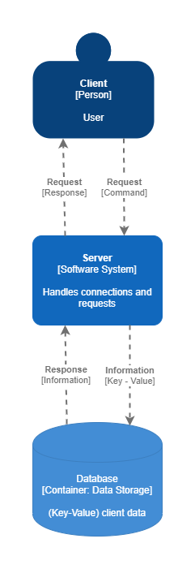

# Architecture

This document describes the high-level architecture of our Redis implementation.

## High-level overview

When the server starts up, it listens for TCP connections on a specific address. 

### Normal command flow

Whenever a non-pubsub command is received the flow is as follows:

1. The server parses a single command from the connection into a `Command` object using the `protocol::Request` struct.
2. The command is logged using the `logging::Logger` object.
3. The command is passed on to the `Execution` engine which maps the command by name into the correct executing function.
4. The executing function executes the command and builds a response using the `protocol::ResponseBuilder`.
5. The response is written to the connection as a response.
6. If the connection was not closed by the client then return to step 1.

### Publisher subscriber flow

The main difference in the publisher-subscriber flow is that whenever a `SUBSCRIBE` command is executed,
the client is set in the `pubsub` state and saved in an indexed channel list. Therefore when later another client issues
a `PUBLISH` command all the clients subscribed to that channel can be retrieved and updated.

## Modules

This section talks briefly about various important directories and data structures we used.

### `src`

This folder contains all of the other code modules as well as the key 
components of the architecture like `Server` and `Client` structs.

### `src/config`

The config module exposes a `Configuration` struct which holds all the server customizable attributes. 
It also provides methods for saving and loading configurations from disk.

### `src/logging`

The logging module exports a `Logger` struct. This struct provides methods for writing messages into a log file parallelly. 
The logger instantiates a new writer thread which communicates to other threads with the use of channels.

### `src/protocol`

This module contains all the code for reading and writing in the `RESP` protocol format. The module contains different parsers
for the different Redis data types and ways of representing them. The module exports a Rust enum for representing all possible values from the protocol `ProtcolType`, a `Command` struct 
for representing an already parsed command, a `Request` object for parsing a `Command` from a string, and a `ResponseBuilder`
 an object for building an RESP-compatible response.

### `src/storage`

From this module, the `SafeDataStorage` struct is exported which is an implementation of a thread-safe key-value in-memory database.
It also has methods for serializing and deserializing the in-memory database to the disk.

#### Data storage serialization format

* Each entry is separated by the newline character (`\n`)
* Information about the key-value pair is separated by `;` characters.
* If the entry contains multiple values, they are divided by `,`

This leaves us with the following format:

`KEY_NAME;|KEY_TYPE|;LAST_ACCESS_TIMESTAMP;EXPIRATION_TIME;VALUE`

##### Examples

* `Daniela;|STRING|;last_access;0;hola` → A key named `Daniela` of type `String` with no expiration and a value of `hola`
* `Martin;|LISTA|;ultima_vez_visitada|;0;buen,dia` → A key named `Martin` of type `List` with no expiration and a value of `[buen, dia]`
* `Tomas;|SET|;ultima_vez_visitada;0;buen,dia` → A key named `Tomas` of type `HashSet` with no expiration and a value of `{"buen", "dia"}`

### `src/*_command`

These folders contain the code for each of the command groups. Each command is in a different file.

### `tests`

This folder contains all the integration tests for the crate.

## Tests

This project contains both unit and integration tests.

### Unit tests

Unit tests are defined inside each module, in each file. They are also defined on a per-command basis, each command also has several unit tests. Unit tests mock other dependencies and focus on testing a specific functionality
of our code.

### Integration tests

Integrations tests are located inside the `tests` folder. Inside they are grouped in modules depending
on the command type. These tests, test functionality in conjunction with other parts of the project. Inside these tests, nothing is mocked and the components are run in a production-like environment.

Each integration test starts up a server instance on a different port, making it possible for them to run in parallel.
The server is being polled until it is ready to accept connections. Then a Redis client is created using the `redis` crate
and commands are executed. Finally, the responses are received by our test and the values validated.

